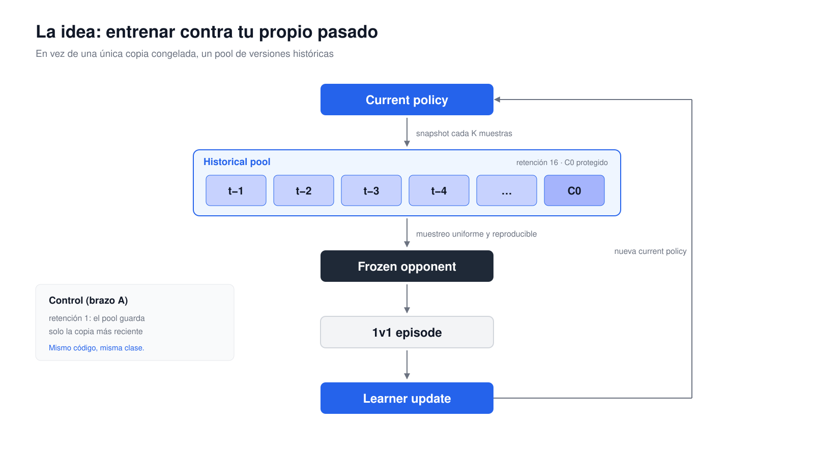
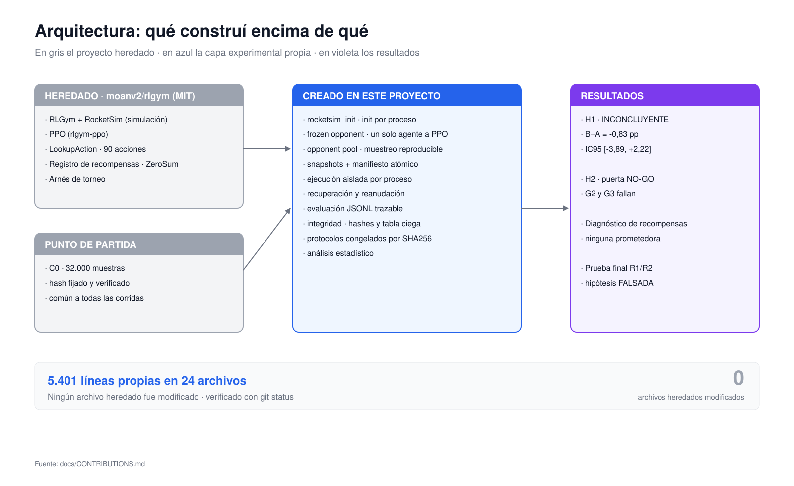
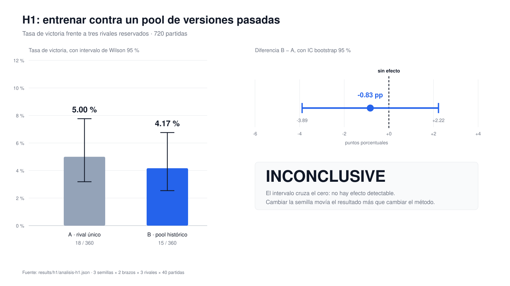
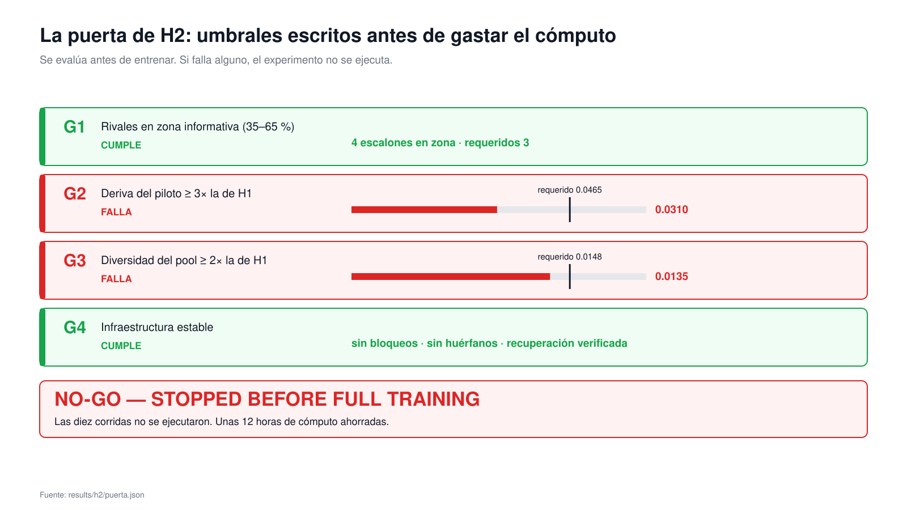
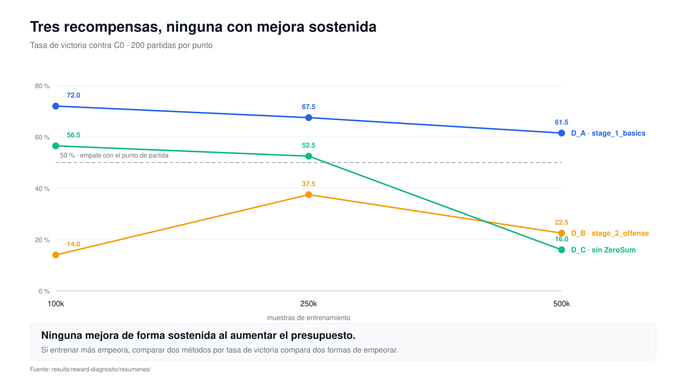
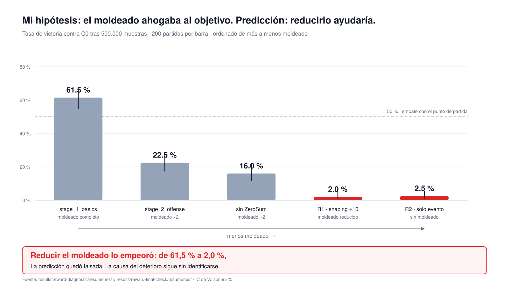

# La historia del proyecto

**Cómo intenté averiguar si un agente aprende mejor entrenando contra su propio
pasado, por qué no pude demostrarlo, y qué encontré por el camino.**

Basado en [moanv2/rlgym](https://github.com/moanv2/rlgym) (MIT).
Fecha de cierre: 8 de septiembre de 2026.

Este documento cuenta el proyecto entero desde cero. No hace falta haber leído
nada más. Los números son los reales; los errores también.

---

## 1. Contexto

**Rocket League** es un videojuego de fútbol con coches: dos equipos, una pelota
enorme, coches que aceleran, saltan y vuelan. En 1 contra 1, cada partida es un
duelo. Marcar gol es raro y depende de una cadena larga de decisiones.

**El aprendizaje por refuerzo** entrena a un agente sin decirle qué hacer: el
agente actúa, recibe una recompensa numérica y ajusta su comportamiento para
acumular más recompensa. No hay ejemplos correctos que copiar, solo consecuencias.

**El autojuego** (*self-play*) resuelve el problema de contra quién entrenar: el
agente juega contra sí mismo. A medida que mejora, su rival mejora, y la
dificultad se mantiene siempre al filo de lo que puede manejar. Es la idea detrás
de AlphaGo y de casi todos los agentes competitivos modernos.

**RLGym** es la capa que convierte Rocket League en un entorno de aprendizaje por
refuerzo. Su variante `rlgym_sim` usa **RocketSim**, una reimplementación de la
física del juego que corre sin gráficos y mucho más rápido que el juego real.

**La base heredada.** Partí de `moanv2/rlgym`, un proyecto final de la asignatura
de Reinforcement Learning en IE School of Science and Technology, publicado con
licencia MIT. Incluye el entorno 1v1, el entrenamiento con PPO, un registro de
recompensas configurables y un arnés de torneo para enfrentar bots entre sí.

> **El bot de Rocket League no es mío.** Ni el entorno, ni el arnés de torneo, ni
> las recompensas. Son obra de sus autores originales. Lo que construí encima es
> una capa experimental, y este documento trata de eso.

---

## 2. La pregunta inicial

El autojuego tiene un problema conocido: si entrenas siempre contra tu **yo
inmediatamente anterior**, puedes caer en ciclos. Aprendes a batir la estrategia
de ayer, olvidas cómo defenderte de la de anteayer, y al cabo de un tiempo vuelves
a una versión de la que ya habías escapado. Es el equivalente a piedra-papel-tijera:
mejorar contra el rival actual no significa mejorar en general.



*Figura 3 — La idea: entrenar contra un pool de versiones históricas.*

La solución clásica se llama *fictitious self-play*: en vez de un solo rival,
guardas un **conjunto de versiones antiguas de ti mismo** y entrenas contra una
mezcla de ellas. Así no puedes olvidar lo que ya sabías batir.

**La pregunta del proyecto:**

> ¿Entrenar contra una memoria de versiones anteriores de uno mismo produce un
> agente más robusto que entrenar contra una única copia congelada del yo
> reciente, **con el mismo presupuesto de aprendizaje**?

Era razonable preguntarlo por tres motivos. Primero, la técnica está bien
establecida a gran escala pero rara vez se mide a escala pequeña. Segundo, el
coste extra es casi nulo: guardar instantáneas es barato. Y tercero, la condición
«con el mismo presupuesto» hace la comparación justa y falsable: si el pool
ayuda, tiene que ayudar sin gastar más.

---

## 3. Qué existía antes

Del proyecto heredado usé, sin modificar nada:

| Componente | Qué hace |
|---|---|
| **PPO** (`rlgym-ppo`) | el algoritmo de aprendizaje: recoge experiencia con la política actual y la mejora en pasos controlados |
| **Simulación** (`rlgym_sim` + RocketSim) | física de Rocket League sin gráficos, miles de pasos por segundo |
| **Políticas** | redes de tres capas de 512 unidades; entrada de 89 números que describen coches y pelota, salida entre 90 acciones discretas |
| **Recompensas** | un registro configurable por YAML: ir hacia la pelota, mirarla, empujarla a portería, marcar. Envueltas en `ZeroSumReward`, que resta al rival lo que suma el agente |
| **Checkpoints** | carpetas con los pesos de la política y del crítico |
| **Arnés de torneo** | enfrenta dos checkpoints y cuenta goles |

Todo eso funcionaba. Lo que no existía era nada para **hacer un experimento
controlado** con ello.

---

## 4. Qué construí yo



*Figura 2 — Qué construí encima de qué. En gris lo heredado, en azul lo propio.*

Esta es la parte propia. La fuente de verdad es
[`CONTRIBUTIONS.md`](CONTRIBUTIONS.md); aquí explico el porqué.

### 4.1 Que RocketSim arranque en cada proceso

En Windows, Python crea procesos hijo con `spawn`: **no heredan la memoria del
padre**. RocketSim necesita cargar las mallas de colisión una vez por proceso, y
los trabajadores morían nada más nacer.

`rocketsim_init.py` garantiza esa inicialización exactamente una vez por proceso,
con ruta absoluta y sin tragarse excepciones: si las mallas no están, falla con un
mensaje claro en lugar de morir a medias.

### 4.2 El adaptador de rival congelado — la pieza crítica

Aquí está el detalle que hace válido todo el experimento.

PPO espera un entorno con **un agente**. Rocket League 1v1 tiene **dos**. Si le
entregas los dos, PPO trata al rival como un segundo aprendiz y **su experiencia
entra en las actualizaciones**. Estarías entrenando con datos del oponente y
midiendo otra cosa distinta de la que crees.

`EntornoRivalCongelado` expone **un solo agente** al aprendiz. El rival actúa
dentro de `step()`, con una política congelada y sin gradiente, y solo la
experiencia del aprendiz llega a PPO.

```
        ┌───────────────────────────────────────┐
 PPO ◄──┤  EntornoRivalCongelado                │
        │    reset() → obs del aprendiz         │
        │    step(a) → el rival decide dentro   │
        │              y no deja rastro en PPO  │
        └───────────────────────────────────────┘
```

`check_adapter.py` existe solo para comprobar esa garantía.

### 4.3 El pool de rivales

`PoolRivales` guarda instantáneas de la política y las sirve como rivales:

- **Instantáneas**: cada K muestras se guarda una copia de los pesos.
- **Manifiesto atómico**: el índice se escribe en un temporal y se mueve con
  `os.replace`, para que una interrupción no deje un índice a medias.
- **Hashes**: cada instantánea lleva su SHA256; al final se verifica que ninguna
  cambió.
- **Muestreo reproducible**: el rival de cada episodio sale de
  `default_rng((semilla * 1_000_003 + episodio) % 2^63)`. Misma semilla, mismos
  rivales, en el mismo orden.
- **Retención con protección**: se conservan las N más recientes, expulsando las
  más antiguas, salvo las protegidas (C0 nunca se expulsa).

Los dos brazos usan **la misma clase**. Lo único que cambia es la retención: 1
para el control, 16 para el tratamiento. Esa simetría importa: si cada brazo
usara código distinto, cualquier diferencia podría venir del código.

### 4.4 Ejecución que no se rompe

- **Una corrida por proceso**, sin excepción.
- **Detección de estancamiento**: si el log deja de avanzar, se mata el árbol y la
  corrida se marca INCOMPLETA en lugar de colgarse en silencio.
- **Detección de huérfanos**: ningún descendiente puede sobrevivir a su corrida.
- **Marcador explícito** COMPLETA/INCOMPLETA en disco; el conductor no avanza sin
  él.
- **Reanudación idempotente**: una corrida completa no se repite; una incompleta
  se rehace **entera desde C0**, nunca se continúa a medias.

### 4.5 Evaluación trazable

Cada partida es una línea de JSONL con identificador único, semilla, lado,
resultado, causa de terminación y **los hashes de las dos políticas que
jugaron**. Reanudar no repite partidas. Los agregados se derivan del JSONL;
ninguno se acumula a mano.

### 4.6 Protocolos congelados

Antes de cada experimento escribí un JSON con **todas** las decisiones —
recompensa, C0, K, retención, presupuesto, semillas, número de partidas y el
criterio de decisión — y calculé su **SHA256**. Los scripts verifican ese hash
antes de ejecutar y **se niegan a arrancar si el archivo cambió**.

No es burocracia: es lo que impide ajustar el criterio después de ver los
resultados, que es la forma más fácil y más común de engañarse solo.

### 4.7 Integridad y análisis

`integrity_table.py` produce una tabla **ciega**: comprueba que las corridas son
válidas y comparables **sin mirar ningún resultado de juego**. Recalcula hashes y
carga cada checkpoint final **en un proceso nuevo** para confirmar que se
recupera de verdad.

`analyze_h1.py` aplica el criterio congelado y emite el veredicto, incluido
«inconcluyente».

---

## 5. Los primeros tropiezos

### 5.1 `DefaultReward` no era lo que yo creía

Escribí varias veces que la recompensa por defecto de `rlgym_sim` era «solo
goles, y por tanto muy dispersa». Al ir a leer el código, resultó ser
`−|velocidad_angular|/100`: **penaliza girar** y no tiene ninguna relación con
marcar.

No era un matiz. Estaba a punto de usarla como línea base «neutra» de un
experimento, y no es neutra: es una recompensa que empuja al coche a no girar.

### 5.2 Las mallas de colisión

RocketSim necesita la geometría del estadio, que viene del juego instalado. No
tenía Rocket League instalado. Se resolvió obteniendo las mallas por otra vía y
guardándolas **fuera del repositorio**, porque son material del juego y no se
redistribuyen.

### 5.3 Cargar pesos ajenos sin abrir la puerta

`torch.load` puede ejecutar código arbitrario al deserializar. Con checkpoints de
terceros, eso es una vía de ejecución remota. Todo el proyecto carga con
`weights_only=True`, sin excepción, incluso cuando eso obligó a rechazar algún
checkpoint. Un entorno virtual separa dependencias; **no protege de un modelo
malicioso**.

### 5.4 Dos métricas que construí y tuve que tirar

- **Varianza explicada del crítico.** Métrica estándar para saber si el crítico
  predice bien. Pero aquí los retornos se calculan **a partir de** los valores
  (`retorno = valor + ventaja`), así que la métrica es **circular**: mide la
  estructura de GAE, no la calidad del ajuste. Descartada.
- **Razón |valor/retorno|.** Con `ZeroSumReward` el retorno medio ronda cero, y
  una razón con denominador cercano a cero se dispara: llegó a 48,3 sin
  significar nada. Descartada.

Ninguna era un error de programación. Eran instrumentos que parecían razonables y
que, al mirarlos de cerca, no medían lo que yo quería medir.

### 5.5 Los sockets de Windows

Al cerrar cada corrida, `rlgym_ppo` lanza `OSError [WinError 10038]` intentando
operar sobre sockets que ya no lo son. Lo di por inofensivo tras verlo una vez.
**Lo era para la corrida que terminaba; no para la siguiente del mismo proceso.**
Volveré sobre esto.

---

## 6. El diseño de H1

| | Brazo A — control | Brazo B — tratamiento |
|---|---|---|
| Rival | una única copia congelada, sustituida cada K | muestreado de un pool de hasta 16 |
| Retención | 1 | 16, con C0 protegido |
| Todo lo demás | idéntico | idéntico |

Lo que se congeló **antes** de entrenar, con SHA256
`8ae06382c83a85ca…`:

| Decisión | Valor | Por qué |
|---|---|---|
| Punto de partida C0 | 32.000 muestras, hash fijado | ambos brazos parten de lo mismo |
| Recompensa | `stage_1_basics` heredada | no inventar pesos nuevos |
| K | 40.000 | con 8.000 las instantáneas salían casi clones |
| Presupuesto | 500.000 muestras por corrida | mínimo con 12 rivales distinguibles |
| Semillas | 20260907/08/09, emparejadas A/B | fijadas antes de ver nada |
| Evaluación | 720 partidas, semillas 5000–5039, lados alternados | rivales **reservados** |
| Criterio | cuatro condiciones simultáneas | escrito antes de los datos |

**Los rivales de evaluación** (tres bots del torneo original, entrenados con entre
2.000 y 2.900 millones de pasos) se reservaron desde el principio y **no se
usaron para ninguna decisión previa**.

**El criterio.** H1 se declara a favor solo si se cumplen **las cuatro**: el
intervalo de confianza excluye el cero, la magnitud supera el ruido entre
semillas, y el signo es consistente en al menos 2 de 3 semillas **y** en 2 de 3
rivales. Cualquier otra cosa es inconcluyente.

---

## 7. H1: el resultado

Seis corridas, 504.000 muestras exactas cada una, integridad verificada en ciego
antes de tocar los rivales reservados. Después, 720 partidas en una sola pasada.

| Brazo | Victorias | Tasa |
|---|---|---|
| **A** — rival único | 18 / 360 | **5,00 %** |
| **B** — pool | 15 / 360 | **4,17 %** |



*Figura 1 — Resultado de H1: el intervalo de la diferencia cruza el cero.*

**B − A = −0,83 puntos porcentuales**
**IC bootstrap 95 % = [−3,89 pp, +2,22 pp]**

### Veredicto: INCONCLUYENTE

**Esto no significa que A sea mejor que B.** El intervalo de confianza contiene
el cero con holgura: los datos son compatibles con que el pool ayude hasta 2,2
puntos, con que perjudique hasta 3,9, y con que no haga nada.

Hay una comparación que lo deja claro: la diferencia entre brazos fue de 0,83
puntos, pero la variación **entre semillas del mismo brazo** fue de 2,5 puntos en
A y 1,7 en B. **Cambiar la semilla movía el resultado más que cambiar el método.**

Y el signo ni siquiera era estable: contra un rival ganaba A por 5 puntos, contra
otro ganaba B por 4,2.

Los 18 frente a 15 triunfos no son un resultado a favor de nadie. Son 33
victorias repartidas en 720 partidas, dentro del ruido.

---

## 8. Qué aprendí de H1

Fui a mirar los checkpoints que H1 había dejado en disco. Tres medidas explican
el resultado mejor que cualquier excusa.

**1. Efecto suelo.** Ambos brazos ganaban ~5 % contra rivales entrenados unas
cuatro mil veces más. Cuando los dos métodos pierden casi siempre, la métrica no
puede separarlos: lo que se observa es la varianza de un suceso raro.

**2. La política apenas se movió.** Tras 504.000 muestras, la distancia relativa
al punto de partida era **0,0155** — un 1,55 % —, y casi idéntica en las seis
corridas (0,0153 a 0,0160).

**3. Las instantáneas del pool eran casi la misma.** Distancia entre pares:
mediana 0,0074, máximo 0,0151. Las 13 «rivales distintas» de B estaban todas
dentro del 1,5 % unas de otras.

La tercera es la importante, y es incómoda: **el tratamiento apenas se
diferenciaba del control**. Entrenar contra 13 copias casi idénticas de uno mismo
no es muy distinto de entrenar contra una sola. H1 no solo carecía de potencia
estadística; la intervención que medía era muy débil.

**Y la retención nunca llegó a activarse.** Con 500.000 muestras y K = 40.000
salieron 13 instantáneas frente a un tope de 16: la regla de expulsión, que yo
presentaba como parte del diseño, no ejerció ningún efecto.

---

## 9. El diseño de H2

H2 nació para corregir exactamente eso:

| Problema de H1 | Corrección en H2 |
|---|---|
| Rivales inalcanzables | **linaje neutral de sparring**: una corrida entrenada contra C0 fijo, con checkpoints a 0,5/1/2/4 M, que da una escalera de dificultad a nuestra escala |
| Política que no se mueve | presupuesto de 2,5 M en vez de 500 k |
| Instantáneas clónicas | K = 100.000 en vez de 40.000, para que el pool cubra más historia |
| Retención decorativa | con 2,5 M y K = 100 k salen 25 instantáneas frente a un tope de 16: **expulsa de verdad** |
| Tres semillas | cinco |
| Bootstrap sobre partidas | **bootstrap jerárquico emparejado**: la unidad experimental es la corrida, no la partida |

Un detalle de diseño del que estoy satisfecho: para calibrar la dificultad usé un
**único agente piloto**. Al no existir ningún agente del brazo B en esa fase, era
**literalmente imposible** elegir rivales mirando a quién favorecen.

### La puerta GO/NO-GO

Y añadí algo que no tenía H1: una puerta con umbrales escritos **antes**, que
había que superar **antes de gastar el cómputo**.

---

## 10. La puerta de H2

| | Criterio | Umbral | Medido | |
|---|---|---|---|---|
| **G1** | ≥ 3 escalones con tasa del piloto en 35–65 % | 3 | **4** | CUMPLE |
| **G2** | deriva del piloto ≥ 3× la de H1 | 0,0465 | **0,0310** | **FALLA** |
| **G3** | diversidad del pool ≥ 2× la de H1 | 0,0148 | **0,0135** | **FALLA** |
| **G4** | infraestructura estable | — | sin bloqueos ni huérfanos | CUMPLE |



*Figura 6 — La puerta de H2: dos de cuatro criterios fallan. NO-GO.*

### Veredicto: NO-GO. Las diez corridas no se ejecutaron.

**G1 funcionó**: el linaje neutral sí produjo rivales en zona informativa, con el
piloto al 55 % contra los cuatro escalones. El problema principal de H1 estaba
resuelto.

**G2 falló por un error de diseño mío.** Yo había extrapolado la deriva **en línea
recta**. Crece como **raíz cuadrada** del presupuesto, y el linaje neutral lo
confirmó punto por punto:

| Muestras | Deriva medida | Predicción √ |
|---|---|---|
| 504.000 | 0,0156 | 0,0155 |
| 1.000.000 | 0,0223 | 0,0218 |
| 2.000.000 | 0,0305 | 0,0309 |
| 4.000.000 | 0,0403 | 0,0437 |

Alcanzar el umbral habría exigido unos **6 millones de muestras por corrida**:
más de 12 horas para las diez.

**G3 falló por poco** —0,0135 frente a 0,0148— y tenía arreglo barato: con
K = 150.000 la mediana sube a 0,0174 sin tocar el presupuesto. La retención, eso
sí, **se activó de verdad**: 41 instantáneas creadas, 16 conservadas, 25
expulsadas.

### Por qué respetar la puerta importa

**Un NO-GO no es un fallo de software.** Es el sistema funcionando.

La tentación era obvia: bajar G2 de 3× a 2×, que era justo lo medido, y seguir
adelante. Habría sido elegir el umbral después de ver el dato, es decir,
exactamente lo que la puerta existía para impedir. El umbral estaba escrito antes
y se aplicó como estaba escrito.

Lo que se ganó: **no gastar 12 horas de cómputo en un experimento cuya propia
premisa ya sabía que no se sostenía.**

---

## 11. Un problema más profundo

Durante la calibración apareció algo que nadie había pedido mirar.

El agente piloto —2,5 millones de muestras, cinco veces el presupuesto de H1—
ganaba solo el **15 %** de sus partidas contra **C0**, su propio punto de
partida.

Comprobé si le pasaba solo a él. No:

| Agente | Muestras | Tasa contra C0 |
|---|---|---|
| S@500k | 500.000 | 42,5 % |
| S@1M | 1.000.000 | 17,5 % |
| S@2M | 2.000.000 | 32,5 % |
| S@4M | 4.000.000 | 22,5 % |
| Piloto | 2.500.000 | 15,0 % |

*(40 partidas cada uno: margen amplio, pero cinco de cinco por debajo del 50 %.)*

Esto **invalidaba la premisa** de todo el proyecto. H1 y H2 comparan brazos por
tasa de victoria, lo que presupone que entrenar más la mejora. Si entrenar más la
empeora, comparar dos brazos es comparar dos formas de empeorar.

---

## 12. El diagnóstico de recompensas

Tres configuraciones, fijadas de antemano, 500.000 muestras cada una, misma
semilla, mismo rival C0 fijo, **200 partidas por checkpoint**:

| | Recompensa | ZeroSum | 100k | 250k | 500k |
|---|---|---|---|---|---|
| **D_A** | `stage_1_basics` (heredada) | sí | 72,0 % | 67,5 % | **61,5 %** |
| **D_B** | `stage_2_offense` (heredada) | sí | 14,0 % | 37,5 % | 22,5 % |
| **D_C** | `stage_2_offense` sin envoltura | no | 56,5 % | 52,5 % | 16,0 % |



*Figura 5 — Ninguna de las tres recompensas mejora de forma sostenida.*

Con 200 partidas en vez de 40, la imagen se afinó: `stage_1_basics` a 500k **sí**
gana a C0, con un 61,5 % e intervalo [54,6 %, 68,0 %]. Pero **cae** desde el
72,0 % que tenía a 100k. Diez puntos y medio de caída, 2,2 errores típicos: real,
no ruido.

D_A falló el criterio de deterioro **por 0,5 puntos porcentuales**, y se aplicó
como estaba escrito.

**Sobre ZeroSum**: su efecto cambia de signo entre presupuestos (+42,5 pp a favor
de la variante sin envoltura a 100k, −6,5 pp en contra a 500k). Con una sola
semilla **no puede aislarse**, y no es el factor dominante.

---

## 13. Mi hipótesis sobre el *reward shaping*

De ahí salió una explicación con números detrás.

Las recompensas de este proyecto mezclan dos cosas. Los **términos moldeados**
(*shaping*) premian acercarse a la pelota, mirarla, empujarla hacia portería: se
cobran **en cada paso**. El **término de evento** premia el gol: se cobra **una
sola vez**.

La aritmética: `velocity_ball_to_goal` aporta 0,30 por paso durante episodios de
hasta 300 pasos. El gol aporta 8,0, una vez. **El moldeado puede dominar al
objetivo real en un orden de magnitud.**

Eso encajaba con lo observado, y predecía algo comprobable: `stage_2_offense`
**duplica** el peso moldeado (0,60) y es drásticamente peor, pese a llevar *más*
peso nominal de gol. El nombre del archivo promete lo contrario de lo que hace.

**La predicción falsable:** si el moldeado ahoga al objetivo, **reducirlo debería
mejorar el aprendizaje**.

---

## 14. La prueba R1/R2

Protocolo congelado antes de entrenar, SHA `6c2a8cb2001bf9f7…`. Dos
configuraciones derivadas literalmente de `stage_1_basics`, verificadas
componente a componente:

- **R1** — los tres términos densos divididos por 10; `event` intacto.
- **R2** — solo `event`; sin ningún término denso.

| | 100k | 250k | 500k | IC95 a 500k |
|---|---|---|---|---|
| **R1** shaping reducido | 9,5 % | 4,5 % | **2,0 %** | [0,8 %, 5,0 %] |
| **R2** solo evento | 11,5 % | 2,0 % | **2,5 %** | [1,1 %, 5,7 %] |

Ambas **NO PROMETEDORAS**. Ni se acercan al 50 % que exigía el criterio.

---

## 15. La hipótesis, falsada

| Moldeado | Tasa a 500k |
|---|---|
| completo (D_A) | **61,5 %** |
| rebalanceado (D_B) | 22,5 % |
| **dividido por 10 (R1)** | **2,0 %** |
| **eliminado (R2)** | **2,5 %** |



*Figura 4 — Cuanto menos moldeado, peor. La predicción quedó falsada.*

**Cuanto menos moldeado, peor.** Exactamente lo contrario de lo que predije.

Y no fue un fallo de estabilidad: ambas entrenaron sin error, con parámetros
finitos, sin NaN, con la entropía alta (4,40 y 4,44) y sin colapso. La deriva fue
la de siempre (0,0144 y 0,0154, frente a 0,0157). **La recompensa no cambia
cuánto se mueve la política, sino hacia dónde** — y aquí la movió hacia mucho
peor.

Mi aritmética era correcta pero irrelevante. Confundí **«qué término domina la
suma de la recompensa»** con **«qué término aporta señal aprovechable»**. Sin
moldeado, los goles son tan raros que la inmensa mayoría de los pasos no informan
de nada: el agente no tiene de dónde aprender y deriva sin rumbo. El moldeado
denso no era el problema; **era lo único que sostenía el aprendizaje**.

**No propongo una causa alternativa.** No la tengo.

---

## 16. Qué sabemos al cerrar

### ✅ CONFIRMADO — medido y ejecutado

- H1 quedó inconcluyente: B − A = −0,83 pp, IC95 [−3,89, +2,22].
- La variación entre semillas supera a la diferencia entre brazos.
- Tras 504.000 muestras la política se aleja solo un 1,55 % de C0.
- Las instantáneas del pool de H1 eran casi idénticas (mediana 0,0074).
- **La deriva crece como √muestras**, verificado en cinco puntos.
- La regla de retención funciona: 41 creadas, 16 conservadas, 25 expulsadas.
- Un linaje neutral **sí** produce rivales en zona informativa (55 %).
- **En las cinco recompensas probadas, entrenar más degrada la tasa de victoria
  frente a C0.**
- Reducir o eliminar el moldeado hunde el rendimiento: 61,5 % → 2,0 %.
- La infraestructura aguanta: cero huérfanos, reanudación idempotente,
  recuperación de checkpoints verificada.

### ❌ FALSADO — contradicho por los datos

- **Que el exceso de *reward shaping* causara el deterioro.**
- Que `DefaultReward` fuese «solo goles».
- Que la varianza explicada sirviera para validar el crítico aquí.
- Que la razón |valor/retorno| sirviera de calibración bajo ZeroSum.
- Que los errores de cierre de sockets fueran inofensivos.
- Que todos los agentes entrenados perdieran contra C0 *(afirmación mía basada en
  40 partidas; con 200, `stage_1_basics` a 500k gana el 61,5 %)*.

### ❓ NO RESUELTO

- **Por qué entrenar más deteriora el juego frente a C0.** Es el hallazgo central
  y **no tiene explicación identificada**. Sé qué explicaciones no bastan: no es
  exceso de moldeado, no es la envoltura ZeroSum, no es inestabilidad numérica, y
  no es sobreajuste al rival —el rival de entrenamiento y el de evaluación son el
  mismo C0—.
- Si el pool de rivales aporta algo a escalas mayores. H1 no lo resolvió y H2 no
  llegó a ejecutarse.

---

## 17. El resultado científico

La conclusión del proyecto **no** es «el opponent pool no funciona».

Es esto:

> **Con este entorno, este presupuesto y esta configuración no se pudo demostrar
> una ventaja del opponent pool. La investigación posterior reveló limitaciones
> más fundamentales en el proceso de aprendizaje, y una hipótesis explicativa
> formulada después fue falsada experimentalmente.**

La diferencia entre ambas frases no es cosmética. La primera afirma algo sobre el
mundo que estos datos no sostienen. La segunda afirma algo sobre **lo que este
experimento podía y no podía detectar**, que es exactamente lo que se midió.

---

## 18. La ingeniería

Todo calculado desde artefactos en disco.

| | |
|---|---|
| Código propio | **5.401 líneas en 24 archivos** |
| Archivos heredados modificados | **0** |
| Documentación propia | 3.038 líneas |
| Entrenamientos con informe | 15 |
| Muestras procesadas | **12.112.000** |
| Cómputo registrado | 3,00 h |
| Partidas evaluadas | **3.960** en JSONL (+200 duelos) |
| Checkpoints / hitos / instantáneas | 50 / 24 / 160 |
| Protocolos congelados por SHA256 | 4 |

> **Cifras que no deben interpretarse estadísticamente.** Las 3.960 partidas son
> una magnitud de ingeniería, **no una muestra**: proceden de protocolos
> distintos, con rivales, presupuestos y criterios diferentes. Sumarlas para
> calcular una tasa de victoria conjunta no significaría nada. Lo mismo vale para
> los 12,1 millones de muestras: miden trabajo hecho, no calidad obtenida.

---

## 19. Things I got wrong

Cada uno con lo mismo: qué supuse, cómo lo comprobé, qué encontré, qué cambié.

### 19.1 `DefaultReward` era «solo goles»

**Supuse** que la recompensa por defecto de `rlgym_sim` premiaba solo marcar, y
la describí así varias veces como línea base neutra.
**Comprobé** yendo a leer el código en vez de repetir la suposición.
**Encontré** `−|velocidad_angular|/100`: penaliza girar, no codifica la tarea.
**Cambié** la elección de recompensa y añadí una corrección visible en la
documentación, porque afectaba a dos secciones ya escritas.

### 19.2 La varianza explicada del crítico

**Supuse** que serviría para validar el crítico, como en cualquier manual.
**Comprobé** de dónde salían los retornos.
**Encontré** que se derivan de los valores (`ret = val + adv`): la métrica es
circular y mide la estructura de GAE.
**Cambié** a `vf_loss` y documenté por qué la primera no vale aquí.

### 19.3 La razón |valor/retorno|

**Supuse** que una razón cercana a 1 indicaría un crítico calibrado.
**Comprobé** midiéndola bajo `ZeroSumReward`.
**Encontré** que con retorno medio cercano a cero la razón se dispara: 48,3, sin
significado.
**Cambié** de instrumento y lo dejé escrito como descartado.

### 19.4 Los duelos de 40 partidas

**Supuse**, y escribí, que «los cinco agentes entrenados pierden contra su propio
punto de partida».
**Comprobé** más tarde con 200 partidas en vez de 40.
**Encontré** que `stage_1_basics` a 500k **gana** el 61,5 % (IC [54,6, 68,0]). Mi
afirmación absoluta era demasiado fuerte para una muestra con ±15 puntos de
margen, un margen que yo mismo había señalado y luego ignoré al redactar.
**Cambié** la afirmación por la que sí sostenían los datos —la *dirección* del
deterioro—, sin retocar las conclusiones del documento anterior, cuyo veredicto
no dependía de ese punto.

### 19.5 El exceso de shaping

**Supuse** que el moldeado ahogaba al término de gol, con una aritmética que lo
respaldaba.
**Comprobé** con dos configuraciones nuevas y criterio congelado de antemano.
**Encontré** lo contrario: 61,5 % → 2,0 % al dividir el moldeado por diez.
**Cambié** de conclusión y **no** inventé una explicación sustituta.

### 19.6 El campo `recompensa_media_ultimas_10`

**Supuse** que resumía la señal de recompensa de cada corrida.
**Comprobé** al ver que valía 0,0000 en una configuración que no podía dar cero.
**Encontré** que `Policy Reward` no está en el diccionario que devuelve `learn()`
—lo imprime el Learner por separado—, así que mi `.get()` devolvía siempre 0.
**Cambié** a medir la deriva de parámetros, y marqué el campo como inservible en
lugar de borrarlo.

### 19.7 Los errores de cierre de sockets

**Supuse**, tras verlos una vez, que los `WinError 10038` del `cleanup()` eran
inofensivos.
**Comprobé** cuando la corrida siguiente se quedó colgada: 16 hilos en espera,
cero CPU durante 15 minutos, trabajadores desaparecidos.
**Encontré** que son inofensivos para la corrida que **termina**, pero dejan el
estado de sockets corrupto para la **siguiente del mismo proceso**.
**Cambié** la arquitectura a **una corrida por proceso**, que elimina el problema
de raíz sin tocar la biblioteca original.

---

## 20. Qué haría diferente

Reflexión, no plan. No hay más experimentos autorizados.

1. **Medir la premisa antes que la hipótesis.** Dediqué seis corridas a comparar A
   con B antes de comprobar que entrenar mejoraba algo. Esa comprobación cuesta
   40 minutos y habría reordenado el proyecto entero.
2. **Elegir la unidad experimental desde el principio.** El bootstrap de H1
   remuestreaba partidas como si fueran independientes; la unidad real es la
   corrida. No cambió el veredicto, pero el intervalo era más estrecho de lo
   debido.
3. **Poner puertas antes, no después.** La de H2 ahorró 12 horas. Una equivalente
   en H1 habría detectado que las instantáneas eran clónicas antes de entrenar.
4. **Desconfiar de las muestras pequeñas también al redactar.** Calculé bien el
   margen de los 40 duelos y luego escribí como si no existiera.
5. **Separar «domina la suma» de «aporta señal».** Es la lección conceptual del
   proyecto, y me costó una hipótesis entera.

---

## 21. Conclusión

No construí un bot mejor. No demostré que el opponent pool ayude. Y la
explicación que propuse para el problema que encontré resultó ser falsa.

Lo que sí construí es un sistema experimental que **podía decir que no**.

Un sistema que dio «inconcluyente» cuando los datos eran ambiguos, en vez de
buscar el corte que hiciera ganar al tratamiento. Que se detuvo en su propia
puerta por 0,0155 de deriva, en vez de bajar el umbral que yo mismo había
escrito. Que descartó una configuración prometedora por 0,5 puntos porcentuales
porque el criterio estaba fijado de antemano. Y que, cuando puse a prueba mi
propia explicación, la tumbó.

Esa es la parte del trabajo que se generaliza. Los pesos de una política de
Rocket League no le sirven a nadie. Un procedimiento que impide engañarse a uno
mismo, sí.

---

*Detalle técnico completo en [`FINAL_REPORT.md`](FINAL_REPORT.md). Autoría en
[`CONTRIBUTIONS.md`](CONTRIBUTIONS.md). Reproducción en
[`REPRODUCE.md`](REPRODUCE.md).*
